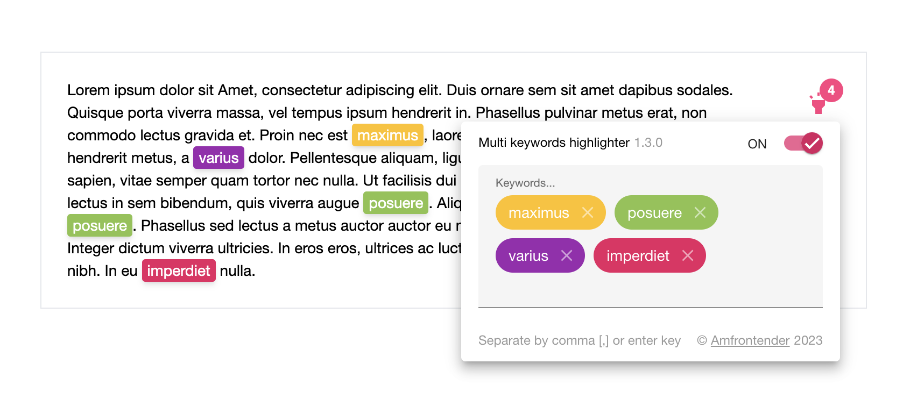

# Ngx Multi Keywords Highlighter Workspace


[](https://github.com/dylannnn/ngx-multi-keywords-highlighter/actions/workflows/release-main.yml)

## Screenshort



## How to use

Add `"node_modules/@amfrontender/ngx-multi-keywords-highlighter/themes/index.scss"` or `"node_modules/@amfrontender/ngx-multi-keywords-highlighter/themes/themes.scss"` to your `angular.json` or `project.json` if you use NX to the build options of styles.

Import the `NgxMultiKeywordsHighlighterModule` to your `app.module.ts`

```typescript
import { LABEL_POSITION, MATERIAL_COLOR, NgxMultiKeywordsHighlighterModule } from '@amfrontender/ngx-multi-keywords-highlighter';
```

Add `NgxMultiKeywordsHighlighterModule` config to the imports

```typescript
@NgModule({
  declarations: [...],
  providers: [
    provideAnimations(),
    importProvidersFrom(
      NgxMultiKeywordsHighlighterModule.forRoot({
        themeColor: MATERIAL_COLOR.ACCENT,
        enableToggleLabel: true,
        toggleLabelPosition: LABEL_POSITION.BEFORE,
        enableHighlighterTooltip: 'On/Off',
        linkToCopyright: true,
        minWidth: 320,
        appRoot: storyRoot,
      }),
    ),
  ],
  bootstrap: [...],
})
export class AppModule {}
```

Add selector to the html

```html
<mkh-multi-keywords-highlighter class="custom-lib"></mkh-multi-keywords-highlighter>
```

For more advanced usages, please check the storybook or the demo app

## Semantic Commits

<!-- prettier-ignore-start -->
| Type     | Notes                                                                                                   |
|----------|---------------------------------------------------------------------------------------------------------|
| build    | Changes that affect the build system or external dependencies                                           |
| chore    | Changes to the build process, release or auxiliary tools and libraries such as documentation generation |
| ci       | Changes to our CI configuration files and scripts                                                       |
| docs     | Documentation only changes                                                                              |
| feat     | A new feature                                                                                           |
| fix      | A bug fix                                                                                               |
| perf     | A code change that improves performance                                                                 |
| refactor | A refactoring                                                                                           |
| revert   | A revert commit                                                                                         |
| style    | UI/UX CHANGES                                                                                           |
| test     | Adding missing tests                                                                                    |
<!-- prettier-ignore-end -->

## Branches

### Feature Branches

#### Release locally with Vadaccio to test

```sh
docker compose up --build -d
```

#### CI Tasks

- Lint all
- Unit Test all
- E2E Test all
- Chromatic Test (TBD)
- Build

### Beta Branch

Beta branch is for pre-release

#### CI Tasks

- Lint all
- Unit Test all
- E2E Test all
- Chromatic Test (TBD)
- Build

### Next Branch

Any new feature, major version update branch

#### CI Tasks

- Lint all
- Unit Test all
- E2E Test all
- Chromatic Test (TBD)
- Build
-

### Develop Branch

Before release, for testing

#### CI Tasks

- Lint all
- Unit Test all
- E2E Test all
- Chromatic Test (TBD)
- Build

### Main Branch

Production ready branch

#### CI Tasks

- Lint all
- Unit Test all
- E2E Test all
- Chromatic Test (TBD)
- Build
